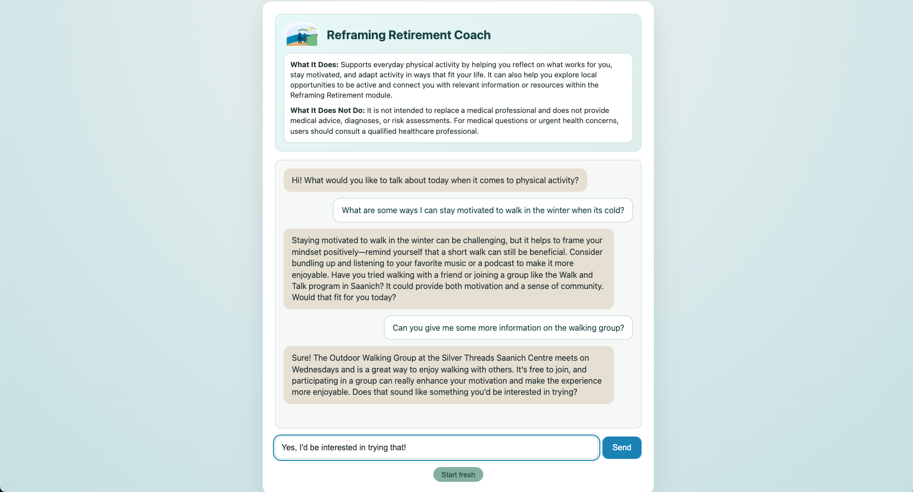
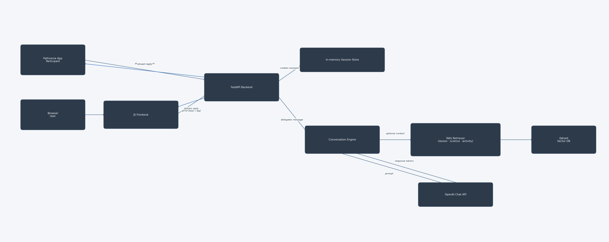
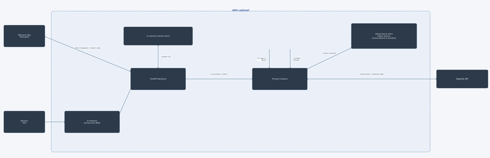

# Reframing Retirement Coach
An autonomy-supportive chat coach that helps newly retired adults plan realistic physical activity by combining retrieval-augmented context with OpenAI guidance.

## Project Status
Deployed cloud hosted MVP under active development.
The system is undergoing ongoing output evaluation and iterative feature development in advance of a planned feasibility study.

## How It Works
The user chats through a lightweight browser UI that streams messages to a FastAPI service. The API spins up a `CoachAgent` session, keeps conversational state in memory, optionally queries the Qdrant vector store for local resources, then composes a grounded prompt for the OpenAI Chat API before streaming the reply back to the browser.

## Key Features
- **Behavior-aware coaching:** The agent silently tracks barriers, preferred activities, and time windows to keep suggestions realistic.
- **Retrieval on demand:** A Qdrant-backed RAG pipeline injects lesson content and local activity options when the user asks for specifics.
- **Browser-first local testing:** The static frontend can hit a local FastAPI instance, giving you the full chat experience in your browser before ever deploying.
- **Safety-first prompt design:** The system prompt enforces scope boundaries (non-clinical, no emergencies) and a motivational interviewing style.

## Experience Snapshot

## Logical System Architecture (Component-Level Flow)
This diagram explains what the system is and how information moves: the retiree’s chat request flows through the frontend, FastAPI layer, in-memory session store, conversation engine, optional RAG retriever, and finally to the OpenAI API before streaming back.

## Deployed Cloud Architecture (Runtime & Infrastructure Flow)
This view shows where everything runs today: the browser talks over HTTP to the AWS-hosted frontend, which forwards chat POST/SSE requests to the FastAPI service. That service manages sessions, pulls vectors from the Qdrant store running on the same AWS host, and sends prompts to OpenAI.

