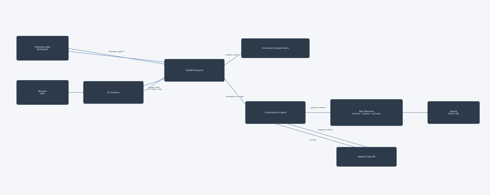

# Reframing Retirement Coach
An autonomy-supportive chat coach that helps newly retired adults plan realistic physical activity by combining retrieval-augmented context with OpenAI guidance.

## Project Status
Deployed on AWS Lightsail and currently under feasibility testing with participants through the Pathverse mobile app.

## How It Works
Participants interact via the Pathverse mobile app (voice-first, hold-to-speak) or a browser web UI — both route to the same FastAPI backend. The API spins up a `CoachAgent` session, keeps conversational state in memory, and queries the Qdrant vector store for relevant lesson content, Science Behind modules, or local activity options depending on what the user is asking. It then composes a grounded prompt for the OpenAI Chat API and streams the reply back to the participant.

## Key Features
- **Behavior-aware coaching:** The agent silently tracks barriers, preferred activities, and time windows across the conversation to keep suggestions realistic.
- **Dual delivery:** Participants engage through the Pathverse mobile app (voice-first with hold-to-speak) or a browser interface; the same backend and coaching logic serve both.
- **RAG pipeline:** A Qdrant-backed retrieval layer covers lesson content, Science Behind modules, and local activity listings. Science-intent queries (research, evidence, studies) are automatically routed to surface science module citations.
- **Safety-first design:** The system prompt enforces non-clinical scope boundaries, no emergency handling, and a motivational interviewing style throughout.
- **Rate-limited session management:** Per-key session caps, per-hour message limits, and concurrent voice stream limits are enforced at the API layer.

## Experience Snapshot

<table>
  <tr>
    <td align="center" width="45%">
       
      <em>Pathverse app (voice-first)</em>
    </td>
    <td align="center" width="55%">
       
      <em>Browser interface</em>
    </td>
  </tr>
</table>

## Logical System Architecture (Component-Level Flow)
This diagram shows how information moves through the system: a participant's message flows from the frontend through the FastAPI layer, which delegates to the in-memory `CoachAgent`. The agent optionally queries the RAG retriever (covering lesson, science, and activity data) before composing a prompt and streaming the OpenAI reply back.

## Deployed Cloud Architecture (Runtime & Infrastructure Flow)
This view shows where everything runs: participants connect via the Pathverse app or browser, hitting the frontend and FastAPI service hosted on AWS Lightsail. The Coach API manages sessions, retrieves vectors from the co-located Qdrant store, and sends prompts to the external OpenAI API before streaming replies back.

