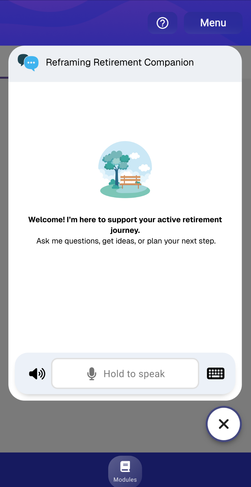
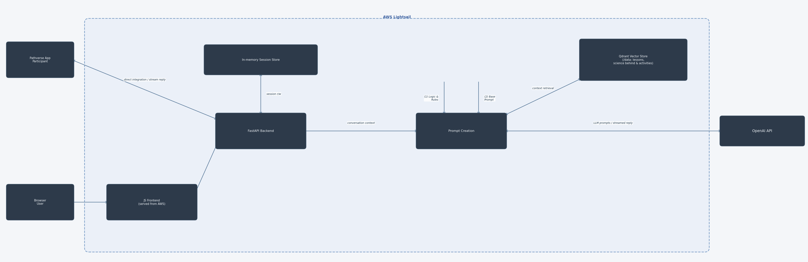

# Reframing Retirement Coach
An autonomy-supportive conversational agent that helps newly retired adults plan realistic physical activity by combining retrieval-augmented context with OpenAI guidance.

## Project Status
Deployed on AWS Lightsail and currently under feasibility testing with participants through the Pathverse mobile app.

## How It Works
Participants interact via the Pathverse mobile app. The API spins up a `CoachAgent` session, keeps conversational state in memory, and queries the Qdrant vector store for relevant lesson content, Science Behind modules, or local activity options depending on what the user is asking. It then composes a relevant prompt for the OpenAI API and streams the reply back to the participant. The chatbot can also be used in browser with a different front end although this is not actively being used by participants.

## Key Features
- **Behavior-aware coaching:** The agent silently tracks barriers, preferred activities, and time windows across the conversation to keep suggestions realistic.
- **Delivery:** Participants engage through the Pathverse mobile app (voice with hold-to-speak or keyboard).
- **RAG pipeline:** A Qdrant-backed retrieval layer covers lesson content, Science Behind modules, and local activity listings.
- **Safety-first design:** The system prompt enforces non-clinical scope boundaries, no emergency handling, and a motivational interviewing style throughout.
- **Rate-limited session management:** Per-key session caps, per-hour message limits, and concurrent voice stream limits are enforced at the API layer.

## Experience Snapshot

<table>
  <tr>
    <td align="center" width="45%">
       
      <em>Pathverse app</em>
    </td>
    <td align="center" width="55%">
       
      <em>Browser interface</em>
    </td>
  </tr>
</table>

## System Architecture
This diagram shows both where everything runs and how data flows through the pipeline. Participants connect via the Pathverse app (direct to FastAPI) or a browser (through the JS frontend hosted on Lightsail). FastAPI manages sessions in an in-memory store, then dispatches each conversation to the Prompt Creation layer — which combines session context with base prompt, logic/rules, and relevant content retrieved from the Qdrant vector store — before streaming the OpenAI reply back.

