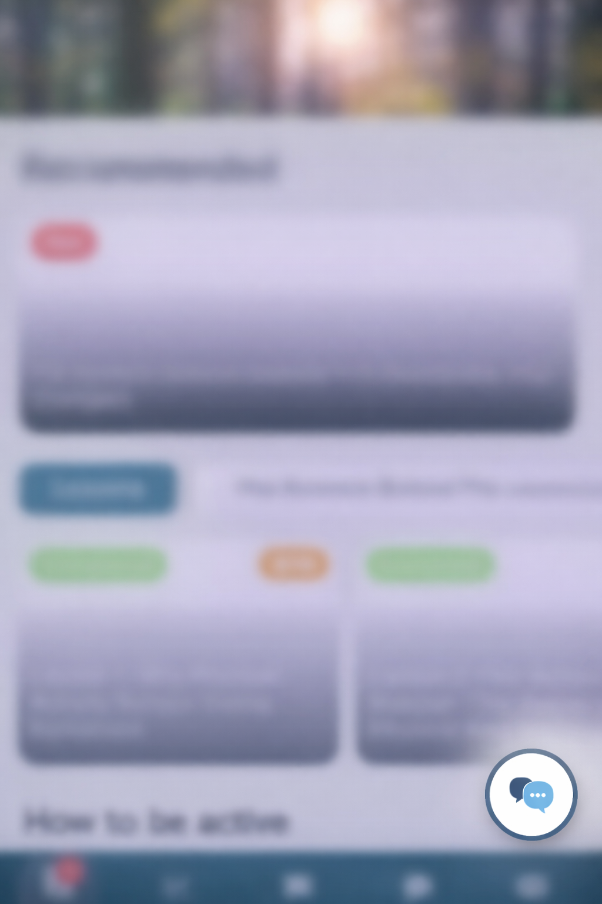
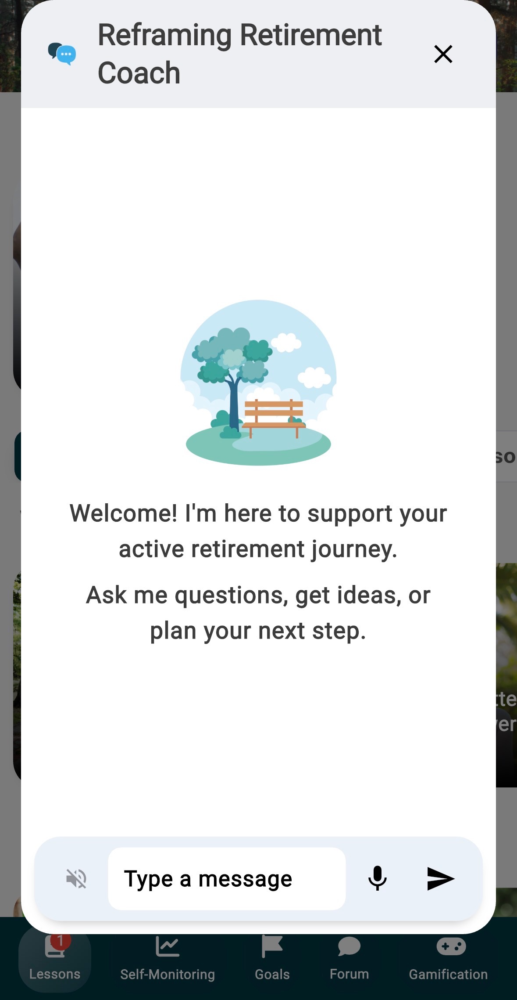
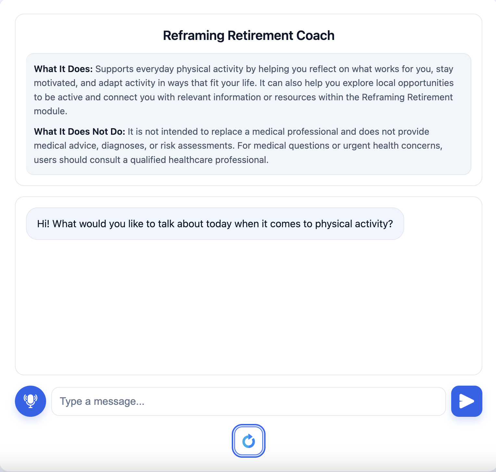
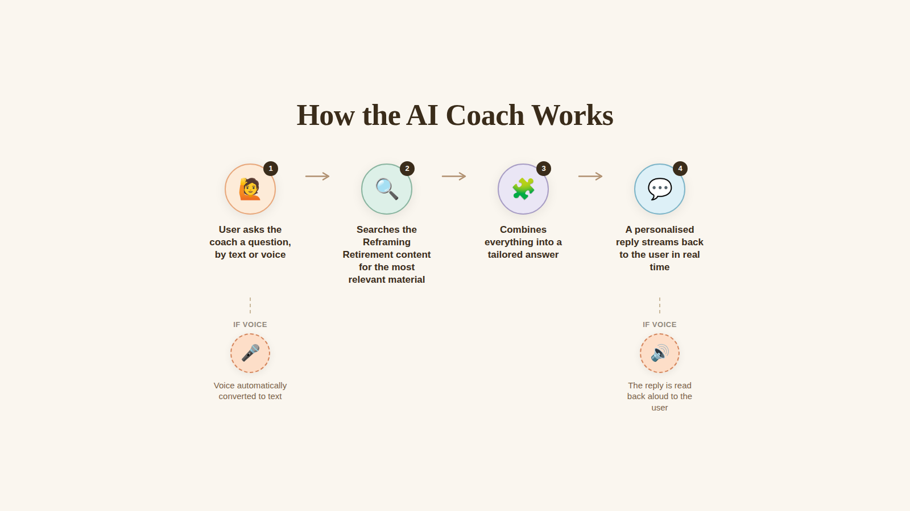

# Reframing Retirement AI Coach

A conversational AI coach that helps newly retired adults build sustainable physical activity habits. This is the working version of the system, currently entering feasibility testing with participants on March 11, 2026.

## What It Does

The coach has a text and voice conversation with participants through the Pathverse mobile app. It asks questions, listens to what the person says, and responds with personalised suggestions that fit their real life: their schedule, their preferences, what they have tried before, and where they are in their thinking about exercise.

It draws on a structured knowledge base built from the Reframing Retirement program content, including program lessons, science summaries, at home exercise resources and local activity options. The coach remembers what each participant shares across the conversation and uses that to keep its suggestions relevant.

The coach is designed around motivational interviewing principles. It does not push or prescribe. It supports the participant in working things out for themselves.

## Research Context

This system is part of a feasibility study examining whether an AI coach can meaningfully support physical activity behaviour change in retirement. The coach is not a clinical tool and is not intended to replace human support. It operates within clearly defined scope boundaries and is designed to complement the broader [Reframing Retirement](https://clinicaltrials.gov/study/NCT07446231) program.

## How Participants Access It

Participants interact through the Pathverse mobile app using either voice (hold to speak) or text. The coach responds in real time, with replies streamed back as they are generated.

A browser-based interface also exists for testing and demonstration purposes, though participants in the study use the Pathverse app.

## Experience Snapshot

<table>
  <tr>
    <td align="center" width="50%">
       
      <em>Opening the coach in Pathverse</em>
    </td>
    <td align="center" width="50%">
       
      <em>Conversation view</em>
    </td>
  </tr>
</table>

Browser interface

 

## How It Works

When a participant sends a message, the system searches a library of program content to find what is most relevant to what they are asking or discussing. It then combines that content with what it already knows about the participant from earlier in the conversation, and uses that to generate a personalised reply.

Voice conversations work the same way. Speech is automatically converted to text, processed the same as a typed message, and the reply is read back aloud.

Everything runs on a secure cloud server. Conversations are kept private and are not stored beyond the active session.

Developers can find technical documentation in the [docs/](docs/) folder.

