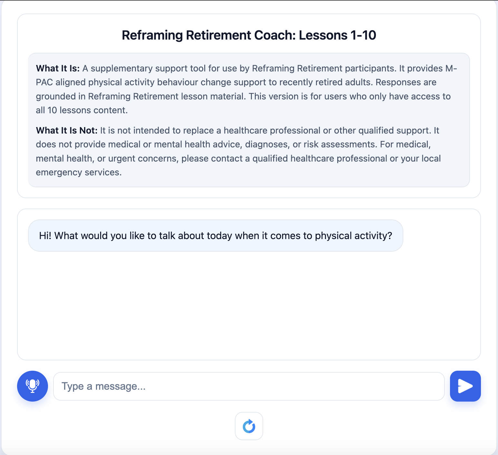

# Reframing Retirement AI Coach


## What it is

- A supplementary support tool for Reframing Retirement participants.
- M-PAC aligned physical activity behaviour change support for recently retired adults.
- Grounded in Reframing Retirement lesson material and its science modules.

## What it is not

- A replacement for a healthcare professional.
- A source of medical or mental health advice, diagnoses, or risk assessments.
- For medical, mental health, or urgent concerns, contact a qualified healthcare professional or your local emergency services.

## Web test version

The browser interface used for testing and demonstration.



## Running locally

```
docker compose up
```

Then open http://localhost:8000.

## Deployment

The main version auto-deploys to an AWS Lightsail instance for non-local use.
